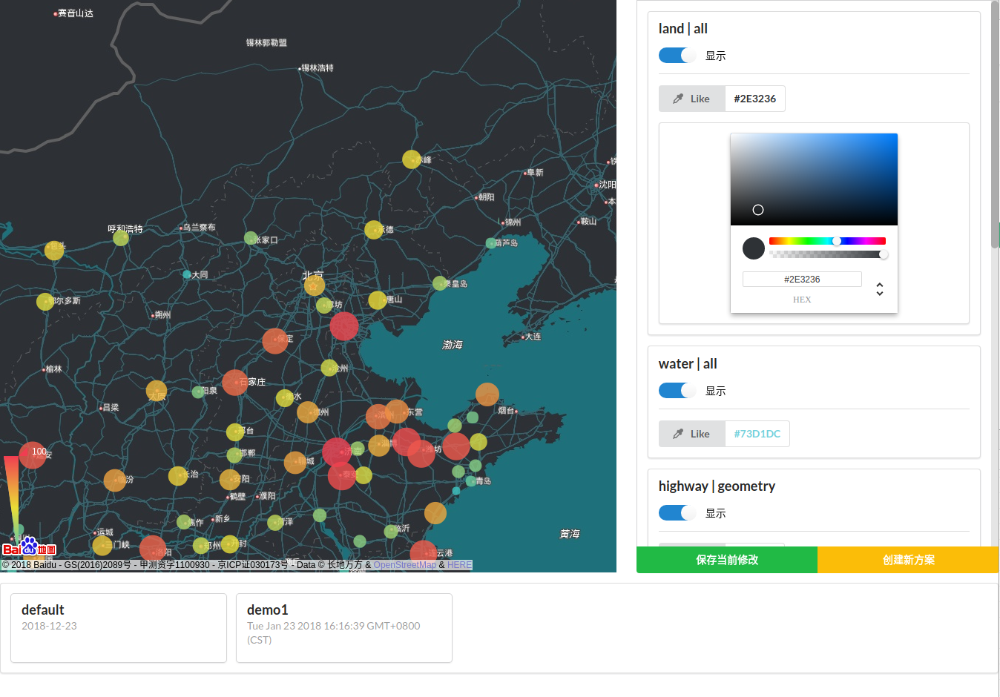

# Map-Color-Picker

> Map-Color-Picker 是一款基于帮助对百度地图进行自定义样式调整的可视化工具。它可以创建多个方案，并将前端完成的方案导出到json文件

使用
+ python3.6 flask
+ webpack + vue

## 安装
```bash
npm i

pip3 install flask
```
添加百度地图access_key(在index.html中)
```html
<script src="http://api.map.baidu.com/api?v=2.0&ak=<your key>"></script>
```
运行前端应用
```bash
npm run dev
# 或
npm run build
# 默认使用8080端口
```
运行后端应用
```bash
# 进入server文件夹
cd server
# 启动flask server (默认占用5000端口)
python3 server.py
```
`options.json` 中保存了用户操作之后的配色方案

## 界面

